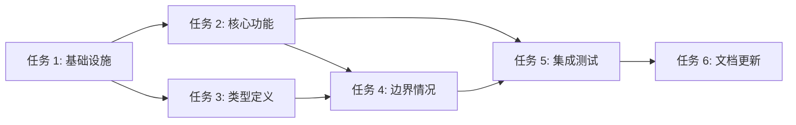

> ETHOS: Golden Age + 完整实现
>
> 写计划(2-5 分钟粒度 + DAG 依赖)是把"模糊意图"压缩成"可执行任务"的关键步骤,跳过它直接写代码是浪费压缩比。

## 🆕 v4.1 P1-2:refactor 场景必加载 plan-eng-review

> **任何重构/refactor/拆解/Facade/兼容 任务在写计划前必须先走 plan-eng-review**
> 跳过它的反模式:"重构就是改结构,不用 eng review" → 重构后才发现数据流破坏、边界情况漏处理

**触发词**（满足任一即触发）：

- 重构 / refactor / 拆分 / 拆解
- Facade / 兼容 / 迁移 / 替代
- 性能优化 / 架构调整

**流程**：

1. 用户提出重构 / refactor / 拆解 / Facade / 兼容 类需求
2. **本 skill 加载时,自动检测是否属于 refactor 类任务**
3. 如属于 → **自动加载 `skill/plan-eng-review`**,4 维度评分(数据流 / 模块边界 / 边界情况 / 测试策略)≥ 7 分
4. eng review 通过 → 走本 skill 写计划
5. eng review < 7 分 → 修完缺口再回来

**为什么这样设计**：

- refactor 任务最容易"看起来简单,实际破坏数据流"
- plan-eng-review 的 4 维度(数据流/模块边界/边界情况/测试策略)是 refactor 的"必答 4 问"
- AI 时代 plan-eng-review 成本 < 5 分钟,跳过它的代价是 refactor 完成后 30+ 分钟回归

---

# 任务规划（Plan-Driven Development）

> 基于 superpowers writing-plans + OpenSpec DAG
> 粒度：每个任务 2-5 分钟
> 完整度优于 TRAE 内置 /plan

---

## 触发场景

满足以下**任一**时自动加载：

- spec 确认后
- 用户说"拆任务"、"写计划"、"任务列表"、"step by step"
- 任务规模 ≥ 5 个子任务
- 任务有依赖关系
- 需要多人/多 agent 协同

---

## 何时使用本 Skill vs TRAE 内置 /plan

| 维度 | TRAE 内置 /plan | 本 Skill |
|------|----------------|----------|
| 触发方式 | 用户输入 `/plan` | SOLO Agent 智能加载 |
| 任务粒度 | 不强制 | 2-5 分钟 |
| DAG 依赖 | 隐式 | ✅ 显式 |
| 并行标记 | ❌ | ✅ |
| 失败域 | ❌ | ✅ 独立失败域 |
| TDD 步骤 | ❌ | ✅ 内嵌每个任务 |

**本 Skill 适用场景**：复杂任务、需要并行、需 TDD、需依赖追踪
**TRAE 内置 /plan 适用场景**：简单任务、用户主动选 /plan

---

## 任务模板

```markdown
## 任务 N：[任务名称]

**预计时间**：2-5 分钟

**文件变更**：
- `src/file1.ts`
- `src/file2.ts`

**实现步骤（TDD 流程）**：

1. **RED**：先写失败的测试
   ```typescript
   test('should X when Y', () => {
     // 失败用例
   });
   ```
2. **GREEN**：写最小代码使测试通过
3. **REFACTOR**：消除重复

**验收标准**：
- [ ] 测试通过
- [ ] Lint 通过
- [ ] 覆盖率 ≥ 80%

**依赖**：任务 N-1（如果存在）
**并行**：可与任务 N-2 并行（如果独立失败域）
```

---

## DAG 依赖图



**DAG 关键原则**：
- 依赖是**使能器**而非门控（OpenSpec 哲学）
- 任务可**并行**（独立失败域）
- 关键节点必须有**门控**

---

## 任务粒度判定

| 粒度 | 适合 | 不适合 |
|------|------|--------|
| **< 2 分钟** | ❌ 太细，浪费时间 | - |
| **2-5 分钟** | ✅ 理想粒度 | - |
| **5-15 分钟** | ⚠️ 可接受但应拆分 | - |
| **> 15 分钟** | ❌ 必须拆分 | - |

**判断标准**：
- 一个任务能被一个 PR 完整提交
- 一个任务的代码变更 < 100 行
- 一个任务的测试 < 20 个

---

## 任务优先级排序

1. **基础设施**（脚手架、类型定义、CI）
2. **核心功能**（满足 FR-001）
3. **边界情况**（FR-002 错误处理）
4. **集成测试**
5. **文档更新**

---

## 任务存储位置

```
.trae/specs/changes/<date>-<feature>/
├── spec.md
├── design.md
└── tasks.md     # 本规划
```

---

## 与其他 Skill 的协作

- **上游**：spec-driven-development（spec 完成后进入）
- **下游**：tdd-workflow（每个任务按 TDD 执行）
- **评审**：plan-reviewer agent（自动派发）

---

## 常见反模式

### ❌ 任务粒度过粗

```
## 任务 1：实现用户认证
预计时间：3 小时
```

### ✅ 正确做法

```
## 任务 1：定义 User 类型
预计时间：3 分钟

## 任务 2：实现密码哈希
预计时间：5 分钟

## 任务 3：实现 JWT 生成
预计时间：5 分钟
...
```

### ❌ 无依赖关系

```
## 任务 1：实现 A
## 任务 2：实现 B
## 任务 3：实现 C
```

### ✅ 正确做法

```
## 任务 1：实现 A
## 任务 2：实现 B（依赖：1）
## 任务 3：实现 C（依赖：1, 2）
```

---

## 输出检查清单

- [ ] 所有任务 2-5 分钟粒度
- [ ] DAG 依赖关系正确
- [ ] 关键节点标注门控
- [ ] 独立失败域标注并行
- [ ] TDD 步骤内嵌每个任务
- [ ] 验收标准可度量

---

## 哲学依据

| 来源 | 贡献 |
|------|------|
| **superpowers** | writing-plans 2-5 分钟粒度 |
| **OpenSpec** | DAG 依赖图 |
| **spec-kit** | 任务规划阶段 |
| **工程哲学 v1** | 任务规划原则 |

---

*基于 superpowers + OpenSpec + 工程哲学 v1*
*创建时间：2026-06-12*
*版本：v3.0*
*加载方式：TRAE 智能扫描 description 自动加载*
