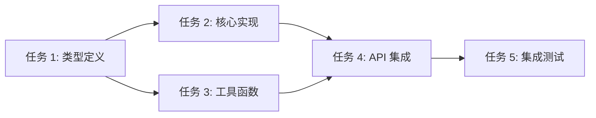
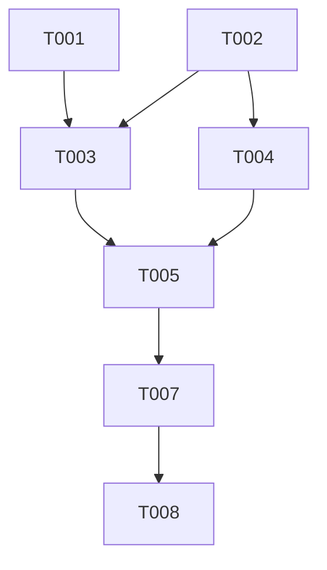

> ETHOS: Golden Age + 完整实现
>
> 写计划(2-5 分钟粒度 + DAG 依赖)是把"模糊意图"压缩成"可执行任务"的关键步骤,跳过它直接写代码是浪费压缩比。

# 任务规划技能（Writing Plans）

> 基于工程哲学 v1 + superpowers writing-plans 融合
> 产出：可执行的任务列表 + DAG 依赖图

---

## 触发条件

- brainstorming Skill 完成后
- 用户确认了规范
- 需求："拆分任务"、"写计划"、"开始实现"

---

## 执行流程

### 步骤 1：分析输入

**读取**：
- 设计文档 `docs/superpowers/specs/<date>-<topic>-design.md`
- 规范文件 `specs/<date>-<feature>-spec.md`
- 项目结构

**识别**：
- 关键实体和 API
- 依赖关系
- 风险点

### 步骤 2：拆分任务

**每个任务必须满足**：

| 属性 | 要求 |
|------|------|
| **粒度** | 2-5 分钟可完成 |
| **独立性** | 尽可能独立 |
| **可测试** | 有明确的完成标准 |
| **可追踪** | 有唯一的任务 ID |

**任务结构**：

```markdown
## 任务 N：[任务名称]

**类型**：type | test | refactor | docs
**预计时间**：2-5 分钟
**依赖**：任务 N-1（如果存在）

**文件变更**：
- `src/file1.ts`：新建
- `src/file2.ts`：修改

**TDD 步骤**：

1. **RED**：写测试
   ```typescript
   test('should xxx', () => {
     // Arrange
     // Act
     // Assert
   });
   ```

2. **GREEN**：写最小实现
   ```typescript
   function targetFunction() {
     // 最小实现
   }
   ```

3. **REFACTOR**：改进代码

**验收标准**：
- [ ] 测试通过
- [ ] 测试覆盖率 >= 80%
- [ ] 代码符合命名规范
- [ ] 无 lint 错误

**预期输出**：
- 运行 `npm test` 通过
- 运行 `npm run lint` 通过
```

### 步骤 3：建立 DAG 依赖

**依赖类型**：
- **强依赖**：必须先完成（如类型定义 → 实现）
- **弱依赖**：可并行（如不同模块的测试）
- **无依赖**：完全独立

**可视化**：



### 步骤 4：生成任务列表文件

保存到 `docs/superpowers/plans/YYYY-MM-DD-<topic>-plan.md`：

```markdown
# [功能名称] 实现计划

## 概述

[功能描述，1-2 句话]

## 范围

- ✅ 包含：[明确包含]
- ❌ 排除：[明确排除]

## 任务列表

### 阶段 1：基础设施

- [ ] **T-001** [类型定义] - 2min
- [ ] **T-002** [基础工具] - 3min

### 阶段 2：核心实现

- [ ] **T-003** [核心逻辑] - 5min
- [ ] **T-004** [边界处理] - 3min

### 阶段 3：测试

- [ ] **T-005** [单元测试] - 5min
- [ ] **T-006** [集成测试] - 5min

### 阶段 4：集成

- [ ] **T-007** [API 集成] - 5min
- [ ] **T-008** [文档更新] - 2min

## 任务依赖图



## 验证步骤

完成后运行：
- [ ] `npm test` - 全部通过
- [ ] `npm run lint` - 无错误
- [ ] `npm run type-check` - 无错误
- [ ] `npm run test:coverage` - 覆盖率 >= 80%

## 风险评估

| 风险 | 可能性 | 影响 | 对策 |
|------|-------|------|------|
| [风险 1] | 中 | 高 | [对策] |

---

*创建时间：YYYY-MM-DD*
*基于规范：specs/<date>-<feature>-spec.md*
*基于设计：docs/superpowers/specs/<date>-<topic>-design.md*
```

### 步骤 5：自审

**必须检查**：

- [ ] 任务粒度合理（2-5 分钟）
- [ ] 依赖关系正确
- [ ] 边界情况已考虑
- [ ] 任务顺序最优
- [ ] 每个任务有验收标准
- [ ] 所有 TDD 步骤完整

---

## 任务类型

| 类型 | 标识 | 用途 |
|------|------|------|
| **type** | T | 类型定义、接口 |
| **core** | C | 核心业务逻辑 |
| **test** | X | 测试编写 |
| **refactor** | R | 重构优化 |
| **docs** | D | 文档更新 |
| **infra** | I | 基础设施 |

---

## 任务粒度判断

### 太粗（需要拆分）

- 预计时间 > 5 分钟
- 涉及多个文件变更
- 包含多个独立功能

### 太细（需要合并）

- 预计时间 < 1 分钟
- 只是单行代码修改
- 不需要测试

### 合适

- 2-5 分钟
- 一个主要变更
- 有清晰验收标准

---

## 任务优先级

```
P0 - 基础设施（类型、常量、配置）
P1 - 核心功能（主要业务逻辑）
P2 - 边界情况（错误处理、验证）
P3 - 集成（API、数据库、UI）
P4 - 优化（性能、用户体验）
P5 - 文档（注释、README）
```

---

## 与其他技能的协作

### 上游

- brainstorming（用户需求）
- /spec 命令（规范文档）

### 下游

- tdd-workflow（每个任务的实现）
- code-review（任务完成后）

---

## 输出检查清单

- [ ] 生成了任务列表文件
- [ ] 包含任务依赖图
- [ ] 每个任务有验收标准
- [ ] 任务粒度合理
- [ ] 验证步骤完整
- [ ] 风险评估已记录

---

## 常见陷阱

| 陷阱 | 表现 | 应对 |
|------|------|------|
| 任务太粗 | "实现用户管理" | 拆分为创建/读取/更新/删除 |
| 任务太细 | "添加一个 import" | 合并到相关任务 |
| 缺少测试任务 | 只有实现任务 | 每个实现必须有对应测试 |
| 依赖混乱 | 循环依赖 | 重新设计任务粒度 |
| 验收标准模糊 | "实现完即可" | 明确可度量的标准 |

---

## 哲学依据

| 来源 | 贡献 |
|------|------|
| **superpowers** | 2-5 分钟粒度、真实代码示例、自审机制 |
| **OpenSpec** | DAG 依赖图、artifact 模型 |
| **spec-kit** | 任务分解作为独立阶段 |
| **工程哲学 v1** | 流体编排、完整实现 |

---

*基于工程哲学 v1 制定*
*创建时间：2026-06-11*
*技能版本：v1.0*
